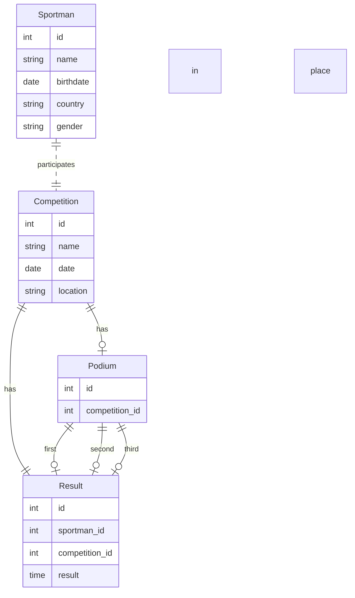

```mermaid
erDiagram
    Sportman ||..|| Competition : participates in
    Competition ||--|| Result : has
    Competition ||--o| Podium : has
    Podium ||--o| Result : first place
    Podium ||--o| Result : second place
    Podium ||--o| Result : third place
    Sportman {
        int id
        string name
        date birthdate
        string country
        string gender
    }
    Competition {
        int id
        string name
        date date
        string location
    }
    Result {
        int id
        int sportman_id
        int competition_id
        time result
    }
    Podium {
        int id
        int competition_id
    }
```
